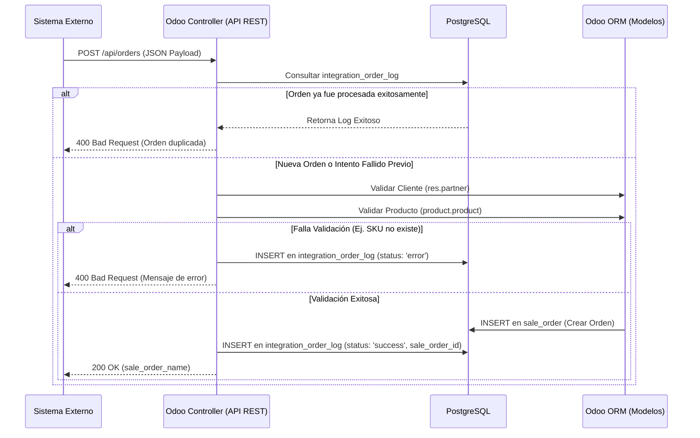

# Odoo B2B External Orders Integration

Solución de arquitectura para la recepción, validación y trazabilidad de órdenes de venta provenientes de un sistema externo B2B hacia Odoo 16, implementando el patrón KISS y minimizando la infraestructura intermedia.

## 1. Instalación y Ejecución

Este proyecto utiliza Docker Compose para levantar el entorno completo (PostgreSQL + Odoo 16) con el módulo _custom_ ya montado en volumen.

1. Clonar el repositorio.
2. Ejecutar el entorno: `docker-compose up -d`
3. Ingresar a `http://localhost:8069` (Usuario/Pass: admin/admin)
4. Activar el Modo Desarrollador en Odoo.
5. Ir a Aplicaciones, "Actualizar lista de aplicaciones" y buscar e instalar: **API External Orders Integration**.

## 2. Diagrama Lógico y de Relación de Datos

El siguiente diagrama detalla el flujo de información, la persistencia y la trazabilidad:



## 3. Documentación y Pruebas de la API

**Endpoint:** `POST /api/orders`
**Content-Type:** `application/json`

Se incluye en la raíz del repositorio el archivo `postman_collection.json` listo para ser importado y ejecutar las pruebas de integración (casos de éxito y manejo de errores por validación de SKU/Cliente).

**Request Payload de Ejemplo:**

```json
{
  "jsonrpc": "2.0",
  "params": {
    "external_id": "ORD-12345",
    "customer": {
      "name": "Cliente de Prueba API",
      "vat": "1053123456",
      "email": "cliente@prueba.com"
    },
    "lines": [{ "sku": "SKU-001", "qty": 5, "price": 120.5 }]
  }
}
```

## 4. Entregables de la Prueba Técnica

Para facilitar la revisión, a continuación se detalla la ubicación de cada uno de los requerimientos solicitados:

- **Código fuente:** Ubicado en la ruta `custom_addons/api_external_orders/` (Incluye controladores REST, modelos del ORM y permisos de seguridad).
- **Instrucciones de instalación y ejecución:** Detalladas en la Sección 1 de este documento.
- **Documentación de la API:** Detallada en la Sección 3 y respaldada por el archivo `postman_collection.json` listo para importar.
- **Consultas SQL:** Archivo `queries.sql` ubicado en la raíz del proyecto.
- **Diagrama lógico y de relación de datos:** Generado dinámicamente con Mermaid en la Sección 2 de este documento.
- **Archivo AGENTS.md:** Ubicado en la raíz del repositorio, documentando el contexto técnico para agentes de IA.
- **Pregunta Teórica (Oracle vs PostgreSQL):** Documentada en formato formal en el archivo `respuestas_teoricas_b2b.pdf`.
- **⭐ Puntos Adicionales (Uso de IA):** Documentados en el archivo `SKILLS.md` en la raíz del repositorio, demostrando el paradigma de desarrollo asistido.
